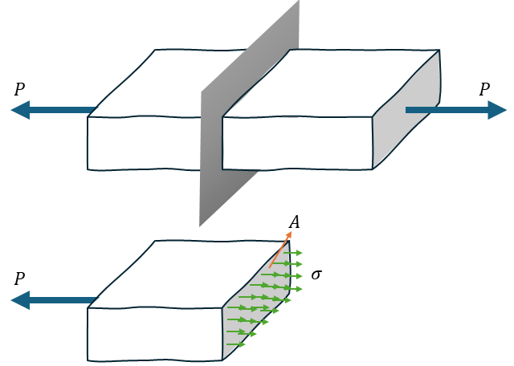

# Introducción a la Mecánica de Materiales

La **Mecánica de Materiales** es una rama de la ingeniería que proporciona los principios fundamentales para el **diseño y análisis estructural**.  
El objetivo principal de su estudio es comprender la relación entre las **fuerzas exteriores aplicadas** (cargas) y las **fuerzas interiores o tensiones** generadas en el material, así como las **deformaciones** resultantes.

Esta base teórica se aplica al diseño de todo tipo de estructuras e ingenierías: máquinas, aviones, edificios y puentes.  
La disciplina también es conocida como **Resistencia de Materiales**, y se diferencia de la **Mecánica Teórica** en que considera las **propiedades reales de los cuerpos deformables**, no ideales o rígidos.

---

## Tensión Normal (σ) y Deformación

Esta sección define los dos conceptos básicos que describen el comportamiento interno (tensión) y externo (deformación) del material.

### Concepto de Tensión (σ)

La **tensión (σ)** representa la intensidad de las **fuerzas internas** en un cuerpo generadas por la aplicación de cargas externas.  
Para analizarla, se realiza un **corte imaginario** (sección transversal) en el cuerpo y se traza un **diagrama de cuerpo libre (DCL)**, donde se visualizan las fuerzas internas que equilibran la carga aplicada. Como se ve en la figura @fig-barra-traccionada

{#fig-barra-traccionada width="70%"}

En una **barra prismática cargada axialmente**, la tensión normal se calcula como:

$$
\sigma = \frac{P}{A}
$$

donde:

- $P$: fuerza axial aplicada
- $A$: área de la sección transversal  

Por convención:

- **Tensión de tracción** → positiva (el elemento se alarga)  
- **Tensión de compresión** → negativa (el elemento se acorta)  

Si la carga se aplica a través del **centroide (Baricentro) de la sección**, se asume una **distribución uniforme** de la tensión.

---

### Concepto de Deformación (δ) y Deformación Unitaria (ϵ)

Cuando se aplica una carga axial, la barra se **alarga o acorta**. El cambio total de longitud se denomina **deformación ($\delta$)**.

La **deformación unitaria ($\epsilon$)**, es una cantidad adimensional que mide la variación relativa de longitud:

$$
\epsilon = \frac{\delta}{L}
$$

donde:

- $\delta = L_f - L_i$: alargamiento o acortamiento total
- $L_i$: longitud original

Por convencion se expresa en **%** o en **‰**, aunque tambien se expresa en unidades como **mm/mm** o **m/m**, aunque físicamente no tiene dimensiones.

---

## Diagramas Tensión–Deformación

Las **propiedades mecánicas** de los materiales se determinan experimentalmente, usualmente mediante el **ensayo de tracción**.  
El resultado se representa en el **diagrama tensión–deformación unitaria**, que describe el comportamiento del material bajo carga.

Para un **acero estructural típico**, se observan las siguientes regiones y puntos característicos:

1. **Límite de proporcionalidad (P):**  
   Región inicial donde tensión y deformación son proporcionales (ley lineal).  

2. **Elasticidad lineal y Ley de Hooke:**  
   En este tramo, el material recupera su forma original al descargarlo.  
   Se cumple:
   \[
   \sigma = E \, \epsilon
   \]
   donde \( E \) es el **Módulo de Elasticidad (o de Young)**, que mide la rigidez del material.

3. **Punto de fluencia (Y):**  
   Momento en que el material comienza a **ceder** sin aumento apreciable de carga.  
   Marca el **límite práctico de trabajo** en diseño estructural.

4. **Plasticidad:**  
   El material soporta deformaciones **permanentes** sin recuperar su forma original al descargarlo.

5. **Tensión última (U):**  
   Máxima carga que el material puede resistir antes de comenzar la fractura.

6. **Fractura (F):**  
   Pérdida total de resistencia; el material se rompe.

7. **Ductilidad y fragilidad:**  
   Los materiales **dúctiles** presentan gran deformación antes de romper, mientras que los **frágiles** fallan con poca deformación.

En el siguiente video se puede observar el ensaño de traccion de una barra de acero.



---

## Tensión Cortante (τ) y Deformación Angular (γ)

Además de la tensión normal (perpendicular a la sección), existen las **tensiones cortantes (τ)**, que actúan **paralelas o tangenciales** a la superficie del material.

### Cálculo del esfuerzo cortante medio

\[
\tau_\text{med} = \frac{V}{A}
\]

donde:
- \( V \): fuerza cortante total  
- \( A \): área donde actúa  

### Deformación angular (γ)

El esfuerzo cortante provoca una **distorsión angular (γ)**, o cambio de forma del elemento.  

### Ley de Hooke para el cortante

En el rango elástico se cumple:

\[
\tau = G \, \gamma
\]

donde \( G \) es el **Módulo de Elasticidad al Cortante** o **Módulo de Rigidez**, relacionado con \( E \) y la **relación de Poisson (ν)** por:

\[
G = \frac{E}{2(1 + \nu)}
\]

---

## Deformaciones Laterales y Relación de Poisson (ν)

Cuando una barra es cargada axialmente, además del alargamiento o acortamiento longitudinal, se producen **deformaciones laterales**:  
un material traccionado se **estrecha**, y uno comprimido se **ensancha**.

La **Relación de Poisson (ν)** se define como:

\[
\nu = - \frac{\text{deformación lateral}}{\text{deformación axial}}
\]

El signo negativo refleja que las deformaciones tienen sentidos opuestos:  
si la axial es positiva (tracción), la lateral es negativa (contracción).

---

## Tensiones Permisibles, Cargas y Factor de Seguridad

El diseño estructural busca garantizar que los elementos **resistan las cargas** sin alcanzar la falla o deformaciones excesivas.

### Conceptos básicos

- **Falla:**  
  Puede significar rotura, colapso o deformaciones inaceptables.  

- **Factor de seguridad (n):**  
  Margen utilizado para proteger contra la falla:
  \[
  n = \frac{\text{tensión de fluencia}}{\text{tensión permisible}}
  \]

- **Tensión permisible (\(\sigma_{perm}\)):**  
  Valor máximo admisible en servicio:
  \[
  \sigma_{perm} = \frac{\sigma_Y}{n}
  \]
  donde \( \sigma_Y \) es la tensión de fluencia.

- **Cargas de servicio:**  
  Son las **cargas reales de operación**, que deben mantenerse dentro del rango elástico del material.

---

## Conclusión del Capítulo

Este capítulo sienta las **bases teóricas y conceptuales** de la Mecánica de Materiales, introduciendo los vínculos entre:
- Cargas aplicadas  
- Tensiones internas  
- Deformaciones resultantes  
