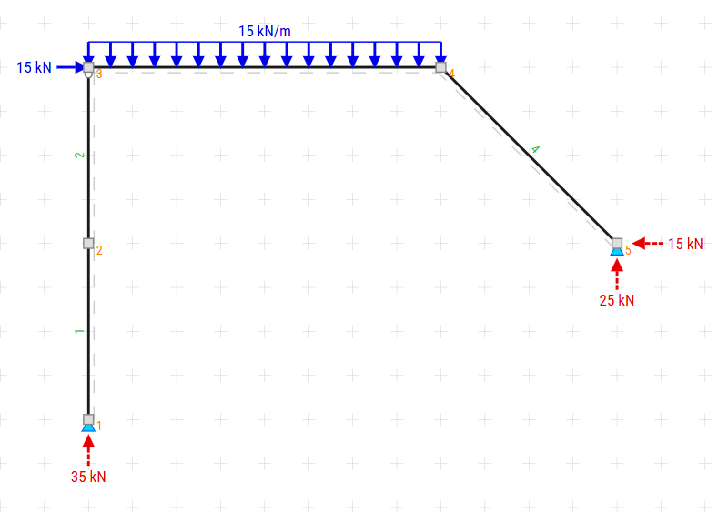
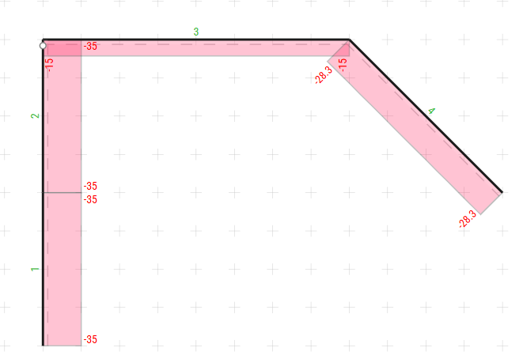
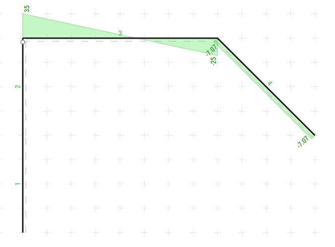
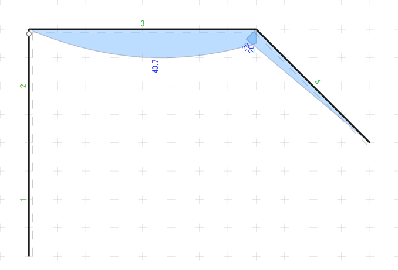

## Dimensionado de la siguiente estructura sencilla

Aquí se muestran los diagramas de esfuerzos para la viga analizada, organizados en una cuadrícula.

::: {layout-ncol=2}

:::

---

## Material

Para el dimensionado de la columna, se utilizarán materiales de acero F-24 (240 MPa) con las siguientes características:

- Tensión de fluencia: $f_{y} = 240 MPa$
- Coef de Seguridad: $\omega = 1.6$
- Tensión de admisible: $f_{adm} = \frac{f_{y}}{\omega} = \frac{240 MPa}{1.6} = 150 MPa$
- Resistencia a corte: $\tau = 0.6 * f_{adm} = 0.6 * 150 MPa = 90 MPa$
- Módulo de elasticidad: $E = 200 GPa$

En $\frac{kg}{cm^{2}}$, los valores son:

- Tensión de fluencia: $f_{y} = 2400 \frac{kg}{cm^{2}}$
- Coef de Seguridad: $\omega = 1.6$
- Tensión de admisible: $f_{adm} = 1500 \frac{kg}{cm^{2}}$
- Resistencia a corte: $\tau_{adm} = 900 \frac{kg}{cm^{2}}$
- Módulo de elasticidad: $E = 2 000 000 \frac{kg}{cm^{2}}$

---

## Dimensionado de la columna izquierda

Según los diagramas de esfuerzos, la columna izquierda está sometida a:

- Esfuerzo Axil (N): - 35 kN -> $3500 kg$
- Esfuerzo de Corte (Q): 0 kN -> $0 kg$
- Momento Flector (M): 0 kN·m -> $0 kg·m$

---

### Dimensionado a compresión

Como el elemento solo esta siendo comprimido, debemos dimensionar solo la formula de compresion, y verificarlo con pandeo.

### Por compresion:

$$
\frac{N}{A} \leq f_{adm} -> A \geq \frac{N}{f_{adm}}=\frac{3500 kg}{1500 \frac{kg}{cm^{2}}}=\frac{3500}{1500} \approx 2.33 cm^{2}
$$

Por lo tanto debemos seleccionar un perfil con un area mayor a 2.33 cm². Para nuestro caso buscaremos un perfil comercial que cumpla con esta condicion.

Siendo este un IPN 80, con las siguientes caracteristicas:

- Area: $A = 7.57 cm^{2}$
- Inercia: $I_{x} = 77.8 cm^{4}$
- Radio de giro: $r_{x} = 3.20 cm$ ; $r_{y} = 0.91 cm$

---

### Verificación de Pandeo

El pandeo se verifica con la formula:
$$
\frac{N}{A} \leq \frac{\pi^{2} * E}{(\frac{L}{K*r})^{2}}
$$

Donde:

 - $N = 3500 kg$: Esfuerzo de diseño (kN) (Valor del Axil en el diagrama)
 - $A = 7.57 cm^{2}$: Area del perfil seleccionado (cm²)
 - $E = 2 000 000 \frac{kg}{cm^{2}}$: Modulo de elasticidad (kN/cm²)
 - $L = 400 cm$: Longitud de la columna (cm)
 - $K = 1$: Coeficiente de longitud efectiva (1 para ambos extremos articulados)
 - $r$: Radio de giro (cm) = $r_{x} = 3.20 cm$ ; $r_{y} = 0.91 cm$

---

|IPN|A (cm²)|rx (cm)|ry (cm)| \lambda | $\frac{N}{A}$  | $\frac{\pi^{2} * E}{(\frac{L}{K*r})^{2}}$  | Cumple |
|---|-------|-------|-------|---|-------------|--------------------------------------------|--------|
| 80 | 7,57  | 3,2   | 0,91  | 439,6          | 462,35                                    | 102,16 | No |
| 100| 10,6  | 4,01  | 1,07  | 373,8          | 330,19                                    | 141,25 | No |
| 200| 33,4  | 8     | 1,87  | 213,9          | 104,79                                    | 431,41 | Si Pero es muy esbelto \lambda>200 |
| 300| 69    | 11,9  | 2,56  | 156,3          | 50,72                                     | 808,52 | Si |

|IPB|A (cm²)|rx (cm)|ry (cm)| \lambda | $\frac{N}{A}$  | $\frac{\pi^{2} * E}{(\frac{L}{K*r})^{2}}$  | Cumple |
|---|-------|-------|-------|--|--------------|--------------------------------------------|--------|
| 100| 53.2  | 4,63  | 2,74  | 146.0          | 65.79                                    | 926.21 | Si |

Adoptamos un IPB 100, ya que es el perfil comercial mas chico que cumple con las condiciones.

Tanto el IPN 300 como el IPB 100 cumplen con la condicion de pandeo, pero el IPB 100 es mas economico y tiene mayor area.

---

## Dimensionado Viga Superior

Según los diagramas de esfuerzos, la columna izquierda está sometida a:

- Esfuerzo Axil (N): - 15 kN -> $1500 kg$
- Esfuerzo de Corte (Q): 35 kN -> $3500 kg$
- Momento Flector (M): 40.7 kN·m -> $407000 kg·m$

Si tendriamos que obtener el moemnto, primero buscamso donde $Q=0$

$ Q = 35 - (q=15)*x = 0  -> x = 2.33 m $

Con ese valor x, obtenemos el momento como en ese punto.

---

### Dimensionado a Flexo-Compresion

Como el elemento esta sometido a un momento flector y a una compresion.

$$
f_{adm} \geq \frac{M}{W} + \frac{N}{A} = \frac{407000}{W} +\frac{1500}{A}
$$

Debemos buscar un perfil, que satisfaga la ecuaciona anterior. Una forma de hacerlo es buscar un perfil que cumpla solo con la flexion y corroborar luego la compresion.

$$
f_{adm} \geq \frac{M}{W}  = \frac{407000}{W} -> W=\frac{407000}{1500} = \frac{4070}{15} = 271.3 cm^{4}
$$

El perfil IPN 220 cumple con esta condicion. Verificamos que el perfil cumpla la flexo-compresion

$$
f_{adm} \geq \frac{M}{W} + \frac{N}{A} = \frac{407000}{278} +\frac{3500}{39.5} = 1464.0 \frac{kg}{cm^2}
$$

Verifica.

---

## Verificacion a Corte

Una vez obtenido el perfil, debemos verificar que el mismo soporte el Corte

$$
\tau = \frac{Q \cdot S*}{J \cdot b} = \frac{3500 \cdot 162}{3060 \cdot 0.81} = 228.75
$$

Donde:

- $Q$ Valor del corte $3500 kg$
- S* Momento estatico de primer orden de media seccion.
- J Momento Estatico de Segundo Orden
- b Espesor del Alma del perfil
