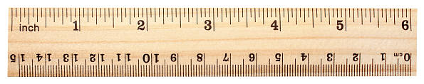

## Bienvenida

La **Resistencia de Materiales** es la materia que nos deja chusmear qué pasa *adentro* de los objetos cuando les aplicamos fuerzas.

:::{.callout-note}
Piénsalo así: es el siguiente nivel después de lo que ya vieron en **Estática** y **Dinámica**.

* Con **Estática**, si algo no se mueve, calculamos las fuerzas para que se quede quieto.
* Con **Dinámica**, si se mueve, calculamos cómo lo hace.
:::

Pero nos falta responder preguntas clave... ¿El material se la banca? ¿Se deforma? ¿Se rompe?

---

## ¿Para qué nos sirve todo esto?

Saber solo las fuerzas de afuera no alcanza. Para que quede más claro, miremos esta estructura súper simple:

Con Estática, podemos calcular las reacciones en los soportes y listo. Pero en la vida real, un ingeniero se hace otras preguntas...

---

## Las preguntas del millón 🤔

Pensemos en cada parte de la estructura:

**1. Sobre la viga BC:**

* Si la viga ya existe, **¿aguanta las cargas o se rompe?**
* ¿Se va a doblar o deformar mucho? **¿Cuánto exactamente?**
* Si la tengo que diseñar yo, ¿qué forma y tamaño me conviene para que sea **barata pero segura**?

---

**2. Sobre la barra que la sostiene (AB):**

* Si ya está puesta, ¿se banca la fuerza que le llega desde la viga?
* **¿Cuál es la fuerza máxima que soporta** y cuánto se va a estirar?
* Si la diseño de cero, ¿qué forma le doy para que no falle ni se estire de más?

---

**3. Sobre los demás componentes...**

También nos preguntamos sobre el **poste de apoyo (CD)** y los **tornillos o pasadores (en A o B)**: ¿son lo suficientemente robustos?, ¿cuál es la carga máxima que aguantan?, ¿qué tamaño deben tener?

---

## La respuesta: Mecánica de Materiales

Bueno, **todas estas preguntas son el corazón de la Mecánica de Materiales**.

Esta materia nos da las herramientas para pasar de *"las fuerzas que actúan sobre un objeto"* a entender *"lo que le pasa al material del objeto por dentro"*.

---

## ¿Qué son las "Estructuras"? 🏗️🚗✈️

En ingeniería, casi todo lo que construimos es una **"estructura"**. No pienses solo en cosas gigantes como puentes o edificios. Una estructura puede ser también el chasis de un auto, el ala de un avión o el brazo de un robot.

Básicamente, es cualquier cosa hecha de varias partes ("miembros") ensambladas para aguantar cargas sin romperse ni deformarse demasiado.

---

### No vamos a diseñar un auto, pero...

Ojo, este curso no es "Diseño de Máquinas" ni "Diseño Estructural". La Mecánica de Materiales te da la **teoría y las herramientas fundamentales** para que después, en esos otros cursos, puedas diseñar cosas específicas.

Diseñar algo real implica pensar en muchas otras cosas:

* **Costo:** ¿Podemos fabricarlo sin fundirnos? 💰
* **Durabilidad:** ¿Cuánto tiempo va a durar funcionando bien?
* **Mantenimiento:** ¿Es fácil de reparar o lubricar?

---

## La misma idea, diferentes aplicaciones

Lo genial de la Mecánica de Materiales es que **sus principios son universales** y se aplican a todas las ramas de la ingeniería.

El principio para diseñar la viga de un puente es el mismo que para diseñar el eje de una máquina.

**¿Qué es lo que cambia entonces?**

* El **tipo y la cantidad de carga**.
* Los **materiales** y las **formas** de las piezas.
* Las **normas de seguridad** de cada industria.

---

## El Corazón del Asunto: Análisis y Diseño

El objetivo final es entender la relación entre estas tres cosas:

**Fuerza de Afuera ➡️ Esfuerzo (Fuerza Interna) ➡️ Deformación**

El truco para dominar la materia es **¡HACER MUCHOS EJERCICIOS!** La práctica es fundamental.

---

## Análisis vs. Diseño

En la práctica, te vas a encontrar con dos tipos de problemas:

**1. Análisis (Modo Detective 🕵️)**
Te dan la pieza y tienes que investigar: ¿cuánto esfuerzo sufre? o ¿cuál es la carga máxima que aguanta?

---

**2. Diseño (Modo Arquitecto/Ingeniero 👷)**
Te dan las cargas y los límites, y tu misión es definir: ¿de qué tamaño y forma tiene que ser la pieza para que sea segura?

---

## Consejos Clave para Resolver Problemas

**1. ¡Dibuja, dibuja y dibuja! ✍️**

* Te ayuda a **entender el problema mucho más rápido**.
* Te permite **visualizar lo que está pasando**.

**2. Sé Prolijo y Ordenado 🧘**

* Un trabajo descuidado no sirve para repasar después.
* La prolijidad te obliga a pensar de forma estructurada.

---

## La Batalla de los Sistemas: Métrico vs. Imperial 🌍 vs. 🇺🇸

Aunque el mundo de la ingeniería usa el **Sistema Métrico (SI)**, en la práctica industrial (sobre todo en EE.UU.) el **Sistema Imperial** (pulgadas, libras) sigue muy presente.

Para esta materia, no nos queda otra que **aprender a trabajar cómodamente con los dos sistemas**.

---

## ¿Por qué no debería asustarte?

Aquí viene la buena noticia: **a los materiales no les importa en qué los midas.**

Los principios de la Mecánica de Materiales son universales. La física de fondo no cambia.

Pasar de un sistema a otro es más fácil de lo que parece. **Es solo un cambio en los números, no en las ideas fundamentales.**